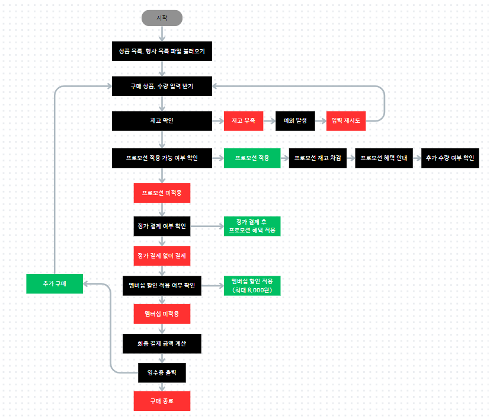

## 🏪 java-convenience-store-precourse

### 📈 플로우 차트

### 📝구현할 기능

- **상품 목록 및 행사 목록 파일 불러오기**
  - products.md와 promotions.md 파일을 읽어와 상품과 프로모션 정보를 로드합니다.

- **상품 및 수량 입력 받기**
  - 사용자로부터 구매할 상품과 수량을 입력 받습니다.
  - 예: [콜라-10], [사이다-3]

- **재고 확인**
  - 입력한 상품에 대해 재고가 충분한지 확인합니다.
  - 재고 부족: IllegalArgumentException 발생 → 에러 메시지 출력 → 입력 재시도
  - 재고 충분: 진행

- **프로모션 적용 가능 여부 확인**
  - 해당 상품이 프로모션에 해당하는지 확인합니다.
  - 프로모션이 적용되는 경우, 프로모션 재고와 일반 재고 상태를 확인하고, 적용 가능한 수량을 계산합니다.
  프로모션 재고 차감
  - 프로모션 혜택을 적용할 수 있으면 프로모션 재고에서 수량을 차감합니다.
  - 프로모션 재고 부족: 일반 재고에서 차감하도록 안내하고, 차감된 금액을 반영하여 최종 결제 금액 계산

- **프로모션 혜택 안내**
  - 프로모션 혜택 추가 여부 확인: 고객에게 더 많은 수량을 가져올지 여부를 입력받습니다.
  - Y: 추가 수량을 가져와 프로모션 혜택 적용
  - N: 추가 수량을 가져오지 않음

- **정가 결제 여부 확인**
  - 프로모션 재고가 부족한 경우 일부 상품에 대해 정가 결제 여부를 묻습니다.
  - Y: 정가로 결제하고, 남은 수량에 대해 프로모션 혜택 적용
  - N: 정가 결제해야 하는 수량을 제외하고 결제 진행
  

- **멤버십 할인 적용 여부 확인**
  - 고객이 멤버십 할인 적용 여부를 묻습니다.
  - Y: 멤버십 할인 적용 (최대 8,000원 할인)
  - N: 멤버십 할인 미적용
  

- **최종 결제 금액 계산**
  - 총구매액: 각 상품의 가격과 수량을 곱하여 계산
  - 프로모션 할인: 프로모션 혜택에 의한 할인 금액 적용
  - 멤버십 할인: 멤버십 할인 적용 후 최종 결제 금액 계산
  - 최종 결제 금액: 최종 결제 금액을 계산하고 출력
  

- **영수증 출력**
  - 영수증에 구매 내역, 증정 상품 내역, 금액 정보를 출력합니다.
  - 구매 상품 내역: 상품명, 수량, 가격
  - 증정 상품 내역: 프로모션에 따른 무료 증정 상품
  - 총구매액: 총 금액
  - 행사할인: 프로모션 할인 금액
  - 멤버십할인: 멤버십 할인 금액
  - 최종 결제 금액
  

- **추가 구매 여부 확인**
  - 추가 구매: 재고가 업데이트된 상품 목록을 확인하고 추가로 구매를 진행 
  - 구매 종료: 결제 종료